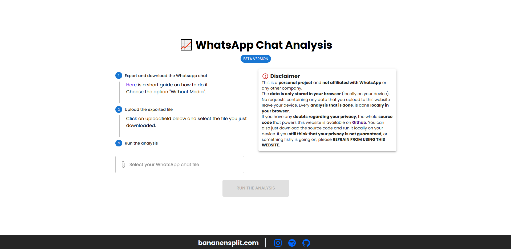

# WhatsApp Chat Analyzer

[![Contributors][contributors-shield]][contributors-url]
[![Forks][forks-shield]][forks-url]
[![Stargazers][stars-shield]][stars-url]
[![Issues][issues-shield]][issues-url]
[![MIT License][license-shield]][license-url]
[![LinkedIn][linkedin-shield]][linkedin-url]


## Analyzes your WhatsApp chats while keeping your privacy

The WhatsApp Chat Analyzer is a web application that aims to give you a thorough analysis of a given WhatsApp chat. All processing and analysis is done locally in your browser so none of your data (neither the messages nor the resulting analysis) is ever sent to a server. This way your privacy is guaranteed at all times. The whole project was written in React and is hosted [here](https://bananensplit.com/whatsapp-chat-analysis). The results of the analysis include the following.

* total number of messages and words
* messages per hour of day
* messages per day of week
* longest messages
* top 100 words used
* top 50 emojis used
* ...




## How to use

**Getting the chatdata**
To export your chatdata you can follow the instructions provided by WhatsApp: ["How to export your chat history"](https://faq.whatsapp.com/1180414079177245). When you are given the choice to export with or without media, choose "without media" as the media files are not supported by the analyzer. When you are done you should end up with a `.txt` file containing your chatdata.


**Analyze the chatdata**
1. Go to the https://bananensplit.com/whatsapp-chat-analysis
2. Drag and drop your previously obtained `.txt` file into the designated area or click on the area to open a file dialog and select the file manually.
3. Click on the "Run Analysis" button and wait for the analysis to finish.
4. Once the analysis is done you can scroll down to see the results.


With larger chatfiles there might be a noticeable delay between clicking the "Run Analysis" button and the results being displayed. This is due to the fact that all processing is done locally in your browser and the analysis can take a while for larger files.


## Build

To build this project on your own you need to have [Node.js](https://nodejs.org/en/) and [npm](https://www.npmjs.com/) installed. Once you have installed these you can build the project by running the following commands in your terminal.

```bash
git pull https://github.com/bananensplit/whatsapp-chat-analysis.git
cd whatsapp-chat-analysis
npm install
npm run build
```

You should end up with a `dist` directory containing the built project. You can then host this directory on a webserver of your choice. It is important to note that the project is configured to be hosted in a subdirectory (called `whatsapp-chat-analysis`) of the root of the webserver. You can change this behavior by editing the `base` parameter in the `vite.config.js` file. If you want to host the project at the root of the webserver you can set the `base` parameter to `"/"`.


## Setup for development

To setup this project for development you need to have [Node.js](https://nodejs.org/en/) and [npm](https://www.npmjs.com/) installed. Once you have installed these you can setup the project by running the following commands in your terminal.

```bash
git pull https://github.com/bananensplit/whatsapp-chat-analysis.git
cd whatsapp-chat-analysis
npm install
npm run dev
```

This will start a development server and open the project in your default webbrowser. The server will automatically reload the project when you make changes to the source code. The project will be available at `http://localhost:3000/whatsapp-chat-analysis` by default. If you want to change the port or the subdirectory you can do so by editing the `vite.config.js` file.


## Find a bug? Have an idea?

If you find a bug in the source code or a mistake in the documentation, you can help me by submitting an issue in the [Issuetracker][issues-url]. Even better you can submit a Pull Request with a fix.

Furthermore if you have an idea for a new feature, feel free to submit an issue with a proposal for your new feature. Please add as much detail as possible to the issue description. This will help me to understand your idea and to discuss it with you.

**Thanks for making this project better!**


## Contact

Jeremiasz Zrolka - jeremiasz.zrolka@gmail.com
* Twitter: [@jeremiasz_z][twitter-url]
* Instagram: [@jeremiasz_z][instagram-url]
* LinkedIn: [jeremiasz-zrolka][linkedin-url]


<!-- MARKDOWN LINKS & IMAGES -->
[repo]: https://github.com/bananensplit/whatsapp-chat-analysis

[contributors-shield]: https://img.shields.io/github/contributors/bananensplit/whatsapp-chat-analysis.svg
[contributors-url]: https://github.com/bananensplit/whatsapp-chat-analysis/graphs/contributors
[forks-shield]: https://img.shields.io/github/forks/bananensplit/whatsapp-chat-analysis.svg
[forks-url]: https://github.com/bananensplit/whatsapp-chat-analysis/network/members
[stars-shield]: https://img.shields.io/github/stars/bananensplit/whatsapp-chat-analysis.svg
[stars-url]: https://github.com/bananensplit/whatsapp-chat-analysis/stargazers
[issues-shield]: https://img.shields.io/github/issues/bananensplit/whatsapp-chat-analysis.svg
[issues-url]: https://github.com/bananensplit/whatsapp-chat-analysis/issues
[license-shield]: https://img.shields.io/github/license/bananensplit/whatsapp-chat-analysis.svg
[license-url]: https://github.com/bananensplit/whatsapp-chat-analysis/blob/master/LICENSE.md
[linkedin-shield]: https://img.shields.io/badge/-LinkedIn-black.svg?logo=linkedin&colorB=555
[linkedin-url]: https://www.linkedin.com/in/jeremiasz-zrolka-78431021b
[twitter-url]: https://twitter.com/jeremiasz_z
[instagram-url]: https://instagram.com/jeremiasz_z
